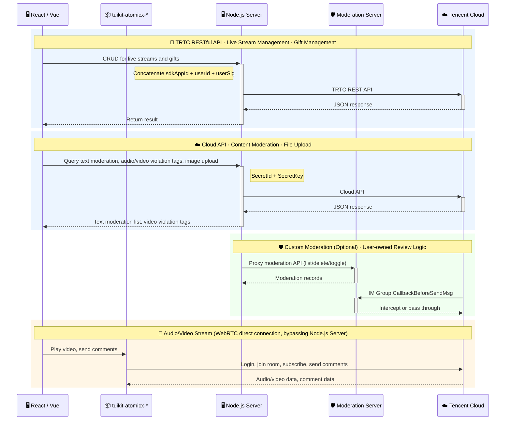

# TUILiveKit Manager

> **中文文档**: [中文版](./README_zh.md)

In live streaming operations, operations management is a critical part of ensuring stable platform operation and improving user experience. The Live Streaming Management System provides one-stop live streaming operations capabilities, covering core features such as live monitoring, room management, gift configuration, and content moderation, with support for both **React** and **Vue 3** frameworks — helping you quickly build a professional live streaming operations system and achieve efficient live room operations and content governance.

You can choose one of the following two integration methods based on your business needs:

| **Integration Method** | **Applicable Scenarios** | **Integration Notes** |
|:---------|---------|---------|
| [Use Directly](#quick-start) | Want to go live quickly without deep customization | After deploying the Live Streaming Management System to your environment, you can use it directly, or embed it into your existing operations system via iframe. |
| [Secondary Development](#custom-development) | Need to unify brand style, or customize features and pages | Develop based on the open-source code; you can customize pages, menus, and features, and integrate them into your existing business system. |

> **Note:**
>
> The Live Streaming Management System does not provide hosted backend services. You need to deploy the server yourself to generate login credentials and call Tencent Cloud-related capabilities. The repository includes a sample server implementation that you can deploy directly or integrate into your existing backend services.

---

## Table of Contents

- [Features](#features)
- [System Architecture](#system-architecture)
- [Quick Start](#quick-start)
- [Advanced Configuration (Optional)](#advanced-configuration-optional)
- [Custom Development](#custom-development)
- [Production Deployment](#production-deployment)
- [Upgrade Guide](#upgrade-guide)
- [Related Documentation](#related-documentation)

---

## Features

<table>
<tr>
<td rowspan="1" colSpan="1" ><strong>Feature Module</strong></td>
<td rowspan="1" colSpan="1" ><strong>Description</strong></td>
<td rowspan="1" colSpan="1" ><strong>UI Preview</strong></td>
</tr>
<tr>
<td rowspan="1" colSpan="1" >Live Monitoring</td>
<td rowspan="1" colSpan="1" >- Supports multi-screen concurrent monitoring and quick live room search by Room ID.<br>- For non-compliant live rooms, if you have integrated <a href="https://cloud.tencent.com/document/product/647/132330">audio/video content understanding</a>, the system automatically displays violation labels.<br>- Operators can force-stop streaming with one click or send violation alerts to hosts, keeping track of live status in real time and responding to risks promptly.</td>
<td rowspan="1" colSpan="1" ><br></td>
</tr>
<tr>
<td rowspan="1" colSpan="1" >Room Details</td>
<td rowspan="1" colSpan="1" >- Supports entering the live room details page to view real-time chat messages, online audience, and core operational data.<br>- Provides management capabilities such as mute all and ban members, helping operators respond to and handle live room issues quickly.<br>- Admins can send admin messages in the chat (entering this page joins the live room with admin identity).<br>- If text moderation is integrated, you can view the live room's text moderation records and use review management features such as batch approval and correction whitelist.</td>
<td rowspan="1" colSpan="1" ><br></td>
</tr>
<tr>
<td rowspan="1" colSpan="1" >Room List</td>
<td rowspan="1" colSpan="1" >- Supports pre-creating live rooms in the backend with a designated host ID; the host can enter the corresponding room directly when going live.<br>- Supports generating OBS streaming URLs so hosts can go live with one click via OBS.</td>
<td rowspan="1" colSpan="1" ><br></td>
</tr>
<tr>
<td rowspan="1" colSpan="1" >Gift Configuration</td>
<td rowspan="1" colSpan="1" >Supports adding, editing, and deleting gifts and gift categories, with multi-language configuration.</td>
<td rowspan="1" colSpan="1" ></td>
</tr>
</table>

## System Architecture

This project adopts an **"Open-Source Demo Shell + Closed-Source Component Package"** delivery model. Core business components are delivered as closed-source npm packages, with only the open-source Demo shell code (routing, layout, menus, configuration) exposed — preventing customers from modifying core source code and breaking upgrade paths. Subsequent upgrades only require replacing the SDK packages as a whole.



```plaintext
TUILiveKit_Manager/          ← GitHub open-source repo
├── packages/
│   ├── react/               ← React Demo Shell (open-source, modifiable)
│   ├── vue3/                ← Vue3 Demo Shell (open-source, modifiable)
│   ├── react-sdk/           ← React Core Package (closed-source)
│   ├── vue-sdk/             ← Vue3 Core Package (closed-source)
│   ├── customization/       ← Extension Protocol Package (open-source, modifiable)
│   ├── server/              ← Server-side Code (open-source, modifiable)
│   └── custom-moderation-server/  ← Custom Moderation Demo Server (open-source, optional)
├── delivery-manifest.json   ← Delivery manifest with package versions & public exports
└── README.md
```

---

## Quick Start

### Step 1: Environment Setup & Service Activation

Before getting started, please refer to the setup guides to complete environment configuration and service activation:

- [Getting Started (Web Vue3)](https://cloud.tencent.com/document/product/647/123049)
- [Getting Started (Web React)](https://cloud.tencent.com/document/product/647/127810)

### Step 2: Download the Project

Download the latest release from GitHub Releases, or clone via git:

```bash
git clone https://github.com/Tencent-RTC/TUILiveKit_Manager
cd TUILiveKit_Manager
pnpm install
```

> **Note:**
>
> The GitHub repository's `packages/react-sdk` and `packages/vue-sdk` directories contain only compiled output and type declarations (`.js` / `.d.ts` / `.css`), not core business source code.

### Step 3: Configure & Start the Server

Edit `packages/server/config/.env`, fill in your SDKAppID, SecretKey, and admin userID, then start the server:

```bash
pnpm run start:server
```

> Default port is 9000. For full configuration details (content moderation, image upload, custom port, etc.), see [Server Documentation](./packages/server/README.md).

### Step 4: Configure & Start the Frontend

Choose your framework and edit the corresponding `.env` file:

**Vue 3:**

Edit `packages/vue3/.env`:

```bash
VITE_API_BASE_URL=http://localhost:9000/api
```

```bash
pnpm run dev:vue
```

**React:**

Edit `packages/react/.env`:

```bash
VITE_API_BASE_URL=http://localhost:9000/api
```

```bash
pnpm run dev:react
```

> **Note:**
>
> The port in `VITE_API_BASE_URL` must match the server port configured in the previous step.

---

## Advanced Configuration (Optional)

The following features can be configured based on your business needs:

- **Image Upload**: Required for gift thumbnails, room covers, etc. Supports three storage providers: Tencent Cloud COS (default), custom HTTP upload, and extending to other services (S3, OSS, etc.). When not configured, the frontend falls back to manual URL input mode. See [Server Documentation — Image Upload](./packages/server/README.md#image-upload).
- **Content Moderation**: Supports text moderation record viewing, batch approval, and correction whitelist. Requires Tencent Cloud API key configuration. See [Server Documentation — Configuration](./packages/server/README.md#configuration).
- **Custom Moderation Server**: When you need fully customizable moderation logic (user-owned database, custom review rules, full audit toggle), you should **develop your own moderation server** that implements the documented [interface spec](./docs/custom-moderation-guide.md) ([中文](./docs/custom-moderation-guide_zh.md)). A minimal prototype (`packages/custom-moderation-server/`) is provided **only to help you validate the end-to-end flow** — it is a reference implementation using SQLite and **must not be used in production**. See [Custom Moderation Guide](./docs/custom-moderation-guide.md) ([中文](./docs/custom-moderation-guide_zh.md)).
- **Violation Label Display**: Requires integration of [audio/video content understanding](https://cloud.tencent.com/document/product/647/132330) capabilities.

---

## Custom Development

The Demo shell code (`packages/react`, `packages/vue3`) is fully open-source. You may modify routing, layouts, menus, branding, and page styles, and extend business capabilities through:

- **Brand & Appearance**: Customize page title, logo, branding via `customer.config.ts`.
- **Component Customization**: Inject custom content via component properties and slots.
- **SDK Entry Configuration**: Configure SDK parameters via `configureLiveManager()` in `live-manager.ts`.
- **Server Extensions**: Extend storage, authentication, and other backend capabilities via the Provider mechanism.

> For detailed component APIs, slot usage, and code examples, see each SDK package's documentation:
> - [React SDK Customization Guide](./packages/react-sdk/README.md#customization)
> - [Vue3 SDK Customization Guide](./packages/vue-sdk/README.md#customization)
>
> For development guides of the Demo projects themselves:
> - [React Demo Development Guide](./packages/react/README.md)
> - [Vue3 Demo Development Guide](./packages/vue3/README.md)

---

## Production Deployment

> **Note:**
>
> - If you have your own server, choose Option 1: Self-hosted Deployment for more flexibility and integration with your existing system.
> - If you want a quick trial or demo, choose Option 2: Cloud Functions + COS/EdgeOne Pages for faster setup without purchasing and configuring servers.

### Option 1: Self-hosted Deployment

- **Server**: After modifying the configuration, deploy `packages/server` to your server. Run `pnpm install` in that directory, then `node src/index.js` to start.
- **Frontend**: After modifying `VITE_API_BASE_URL` in `.env`, run `pnpm run build:vue` / `pnpm run build:react` at the root and deploy the build output to a static server like Nginx. You can also place the build output in the server's `public` directory to share the port (set `VITE_API_BASE_URL=/api`).

### Option 2: Cloud Functions + COS / EdgeOne Pages

- **Server**: Run `npm run deploy:server` and upload `packages/server/dist/scf-deploy.zip` to Tencent [Cloud Functions](https://cloud.tencent.com/document/product/583) (Web Functions, Node.js 20.19).
- **Custom Moderation Server (Optional)**: Run `npm run deploy:moderation-server` and upload `packages/custom-moderation-server/dist/scf-deploy.zip` to Tencent Cloud Functions as well. **Note: this is the minimal prototype and must not be used in production — implement your own server per the [guide](./docs/custom-moderation-guide.md) ([中文](./docs/custom-moderation-guide_zh.md)) before going live.**
- **Frontend**: Create `.env.production` with the Cloud Function request URL, then run `pnpm run build:vue` / `pnpm run build:react` and upload the build output to [COS](https://cloud.tencent.com/document/product/436/38484) or [EdgeOne Pages](https://cloud.tencent.com/document/product/1552/87601).

  ```bash
  VITE_API_BASE_URL=https://your-scf-url.com/api
  ```

> For detailed deployment instructions, see [Server Documentation — Deployment](./packages/server/README.md#deployment).

---

## Upgrade Guide

Since the SDK packages use a closed-source delivery model, follow these steps to upgrade:

1. Download the latest `TUILiveKit_Manager` from the GitHub Releases page.
2. Replace the entire `packages/react-sdk` and `packages/vue-sdk` directories in your project.
3. Compare against `delivery-manifest.json` to confirm version numbers and public exports have no breaking changes.
4. If there are breaking changes, update the corresponding calls in the Demo shell.
5. Run `pnpm install` again and rebuild.

> **Note:**
>
> Do not directly modify files in `packages/react-sdk` or `packages/vue-sdk`, as changes will be lost during upgrades.

---

## Related Documentation

- [Getting Started (Web Vue3)](https://cloud.tencent.com/document/product/647/123049)
- [Getting Started (Web React)](https://cloud.tencent.com/document/product/647/127810)
- [Activate TUILiveKit Services](https://cloud.tencent.com/document/product/647/105439)
- [TUILiveKit Admin Account Management](https://cloud.tencent.com/document/product/647/117216)
- [Content Understanding Service (Domestic)](https://cloud.tencent.com/document/product/647/132331)
- [Cloud Moderation](https://cloud.tencent.com/document/product/269/103733)
- [Cloud Functions Quick Start](https://cloud.tencent.com/document/product/583/54786)
- [COS (Object Storage) Quick Start](https://cloud.tencent.com/document/product/436/38484)
- [EdgeOne Pages](https://cloud.tencent.com/document/product/1552/87601)
- [React SDK Package Documentation](./packages/react-sdk/README.md)
- [Vue3 SDK Package Documentation](./packages/vue-sdk/README.md)
- [Server Documentation](./packages/server/README.md)
