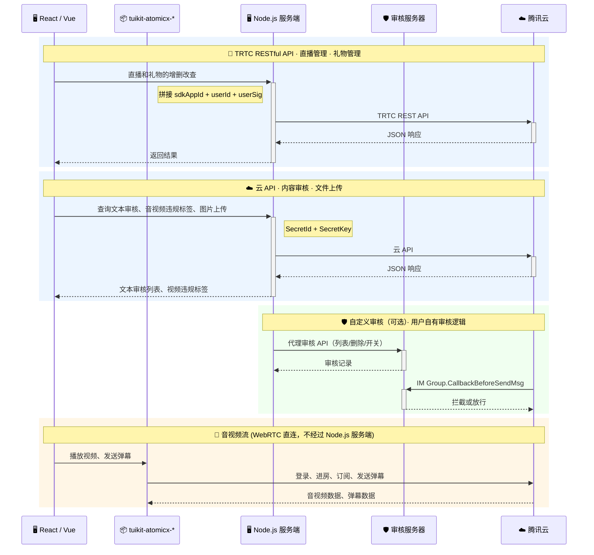

# TUILiveKit Manager

> **English Documentation**: [English](./README.md)

在直播业务中，运营管理是保障平台稳定运行和提升用户体验的重要环节。直播管理系统提供一站式直播运营能力，涵盖直播监控、房间管理、礼物配置、内容审核等核心功能，支持 **React** 和 **Vue 3** 双框架接入，帮助您快速搭建专业的直播运营系统，实现直播间的高效运营与内容治理。

您可以根据业务需求选择以下两种接入方式：

| **接入方式** | **适用场景** | **接入说明** |
|:---------|---------|---------|
| [直接使用](#快速接入) | 希望快速上线，不需要深度定制 | 将直播管理系统部署到您的环境后，可直接使用，或通过 iframe 嵌入到您已有的运营系统中。 |
| [二次开发](#二次开发) | 需要统一品牌风格，或需要对功能和页面进行定制 | 基于开源代码进行开发，可自定义页面、菜单和功能，并集成到现有业务系统中。 |

> **说明：**
>
> 直播管理系统不提供托管的后台服务，您需要自行部署服务端，用于生成登录凭证并调用腾讯云相关能力。仓库中提供了一份服务端示例代码，您可以直接部署使用，也可以将相关能力集成到您已有的后端服务中。

---

## 目录

- [功能介绍](#功能介绍)
- [系统框架](#系统框架)
- [快速接入](#快速接入)
- [进阶配置（可选）](#进阶配置可选)
- [二次开发](#二次开发)
- [生产部署](#生产部署)
- [升级指南](#升级指南)
- [相关文档](#相关文档)

---

## 功能介绍

<table>
<tr>
<td rowspan="1" colSpan="1" ><strong>功能模块</strong></td>
<td rowspan="1" colSpan="1" ><strong>功能说明</strong></td>
<td rowspan="1" colSpan="1" ><strong>UI 示意</strong></td>
</tr>
<tr>
<td rowspan="1" colSpan="1" >直播监控</td>
<td rowspan="1" colSpan="1" >- 支持多路同屏监播和根据 Room ID 快速搜索直播间。<br>- 对于违规直播间，如已接入 <a href="https://cloud.tencent.com/document/product/647/132330">音视频内容理解</a> 能力，系统会自动展示违规标签。<br>- 运营人员可一键强制关播或向主播发送违规告警，实时掌握直播状态并及时处置风险。</td>
<td rowspan="1" colSpan="1" ><br></td>
</tr>
<tr>
<td rowspan="1" colSpan="1" >直播间详情</td>
<td rowspan="1" colSpan="1" >- 支持进入直播间详情页，实时查看弹幕消息、在线观众及核心运营数据。<br>- 提供全员禁言、成员封禁等管理能力，帮助运营人员快速响应和处理直播间问题。<br>- 评论区可以发送管理员消息（进入本页面时会以管理身份进入该直播间房间）<br>- 如已接入 <a href="https://cloud.tencent.com/document/product/269/103732">文本审核</a> 能力，支持查看直播间文本审核记录，并提供批量放行、纠错白名单等审核管理能力。</td>
<td rowspan="1" colSpan="1" ><br></td>
</tr>
<tr>
<td rowspan="1" colSpan="1" >直播列表</td>
<td rowspan="1" colSpan="1" >- 支持在后台预创建直播间并指定主播 ID，主播开播时可直接进入对应房间。<br>- 支持生成 OBS 推流地址，主播可通过 OBS 一键开播。</td>
<td rowspan="1" colSpan="1" ><br></td>
</tr>
<tr>
<td rowspan="1" colSpan="1" >礼物配置</td>
<td rowspan="1" colSpan="1" >支持礼物和礼物分类的新增、编辑、删除，并支持多语言配置。</td>
<td rowspan="1" colSpan="1" ></td>
</tr>
</table>

## 系统框架

本项目采用**"开源 Demo 外壳 + 闭源组件包"**的交付模式。核心业务组件以 npm 闭源包形式交付，仅开源 Demo 外壳代码（路由、布局、菜单、配置），防止客户因改动核心源码而无法升级。后续升级只需整体替换 SDK 包即可。



```plaintext
TUILiveKit_Manager/          ← GitHub 开源仓库
├── packages/
│   ├── react/               ← React Demo 外壳（开源，可修改）
│   ├── vue3/                ← Vue3 Demo 外壳（开源，可修改）
│   ├── react-sdk/           ← React 核心组件包（闭源）
│   ├── vue-sdk/             ← Vue3 核心组件包（闭源）
│   ├── customization/       ← 扩展协议包（开源，可修改）
│   ├── server/              ← 服务端代码（开源，可修改）
│   └── custom-moderation-server/  ← 自定义审核 Demo 服务器（开源，可选）
├── delivery-manifest.json   ← 交付清单，记录各包版本与公开入口
└── README.md
```

---

## 快速接入

### 步骤 1：环境配置及开通服务

在进行快速接入之前，请参考准备工作文档完成环境配置及服务开通：

- [准备工作（Web Vue3）](https://cloud.tencent.com/document/product/647/123049)
- [准备工作（Web React）](https://cloud.tencent.com/document/product/647/127810)

### 步骤 2：下载项目

从 GitHub Release 页面下载最新发布包，或通过 git clone：

```bash
git clone https://github.com/Tencent-RTC/TUILiveKit_Manager
cd TUILiveKit_Manager
pnpm install
```

> **注意：**
>
> GitHub 仓库中 `packages/react-sdk` 和 `packages/vue-sdk` 仅包含编译后的产物和类型声明（`.js` / `.d.ts` / `.css`），不包含核心业务源码。

### 步骤 3：配置并启动服务端

编辑 `packages/server/config/.env`，填写您的 SDKAppID、SecretKey 和管理员 userID，然后启动服务：

```bash
pnpm run start:server
```

> 默认端口为 9000。完整配置说明（内容审核、图片上传、自定义端口等）请参阅 [服务端文档](./packages/server/README_zh.md)。

### 步骤 4：配置并启动前端

选择您的框架，编辑对应的 `.env` 文件：

**Vue 3：**

编辑 `packages/vue3/.env`：

```bash
VITE_API_BASE_URL=http://localhost:9000/api
```

```bash
pnpm run dev:vue
```

**React：**

编辑 `packages/react/.env`：

```bash
VITE_API_BASE_URL=http://localhost:9000/api
```

```bash
pnpm run dev:react
```

> **注意：**
>
> `VITE_API_BASE_URL` 中的端口号要与服务端启动的端口一致。

---

## 进阶配置（可选）

以下功能可根据业务需要选择性配置：

- **图片上传**：礼物缩略图、房间封面等功能依赖图片上传。系统支持腾讯云 COS（默认）、自定义 HTTP 上传接口、扩展其他存储服务（S3、OSS 等）三种方式。不配置时前端自动降级为 URL 手动输入模式。详见 [服务端文档 — 图片上传](./packages/server/README_zh.md#图片上传)。
- **内容审核**：支持文本审核记录查看、批量放行、纠错白名单。需配置腾讯云 API 密钥。详见 [服务端文档 — 配置说明](./packages/server/README_zh.md#配置说明)。
- **自定义审核服务器**：当需要完全自定义审核逻辑（用户自有数据库、自定义审核规则、全员审核开关）时，应当**由用户自行开发**符合 [接口规范](./docs/custom-moderation-guide_zh.md)（[English](./docs/custom-moderation-guide.md)）的审核服务器。仓库内的 `packages/custom-moderation-server/` 仅是一个**用于跑通整套流程的最小原型（参考实现）**，采用 SQLite 存储，**不可直接用于生产环境**。详见 [自定义审核开发指南](./docs/custom-moderation-guide_zh.md)（[English](./docs/custom-moderation-guide.md)）。
- **违规标签展示**：需接入 [音视频内容理解](https://cloud.tencent.com/document/product/647/132330) 能力。

---

## 二次开发

Demo 外壳代码（`packages/react`、`packages/vue3`）完全开源，您可以修改路由、布局、菜单、品牌标识和页面样式，并通过以下方式扩展业务能力：

- **品牌与外观定制**：通过 `customer.config.ts` 自定义页面标题、Logo、品牌信息等。
- **组件定制**：通过组件属性和插槽注入自定义内容。
- **SDK 入口配置**：通过 `live-manager.ts` 中的 `configureLiveManager()` 配置 SDK 参数。
- **服务端扩展**：通过 Provider 机制扩展存储、鉴权等后端能力。

> 详细的组件 API、插槽用法和代码示例请参阅各 SDK 包文档：
> - [React SDK 定制开发指南](./packages/react-sdk/README_zh.md#定制开发)
> - [Vue3 SDK 定制开发指南](./packages/vue-sdk/README_zh.md#定制开发)
>
> Demo 项目本身的开发说明请参阅：
> - [React Demo 开发指南](./packages/react/README.zh.md)
> - [Vue3 Demo 开发指南](./packages/vue3/README.zh.md)

---

## 生产部署

> **说明：**
>
> - 如果您已有服务器，选择方式一：自建部署，更灵活地定制并集成到已有系统。
> - 如果快速试用或演示，选择方式二：云函数 + COS/EdgeOne Pages，无需自行购买和配置服务器。

### 方式一：自建部署

- **服务端**：修改配置后将 `packages/server` 部署到您的服务器，在目录下运行 `pnpm install` 后 `node src/index.js` 启动。
- **前端**：修改 `.env` 中的 `VITE_API_BASE_URL` 后在根目录下 `pnpm run build:vue` / `pnpm run build:react`，将构建产物部署到 Nginx 等静态服务器，或放入服务端的 `public` 目录共用端口（此时可配置 `VITE_API_BASE_URL=/api`）。

### 方式二：云函数 + COS / EdgeOne Pages

- **服务端**：运行 `npm run deploy:server` 将 `packages/server/dist/scf-deploy.zip` 上传至腾讯 [云函数](https://cloud.tencent.com/document/product/583)（Web 函数，Node.js 20.19）。
- **自定义审核服务器（可选）**：运行 `npm run deploy:moderation-server` 将 `packages/custom-moderation-server/dist/scf-deploy.zip` 同样上传至腾讯云函数。**注意：这是最小原型，不可直接用于生产；上线前请依据 [开发指南](./docs/custom-moderation-guide_zh.md)（[English](./docs/custom-moderation-guide.md)）自行实现审核服务器。**
- **前端**：创建 `.env.production` 设置云函数请求地址后，运行 `pnpm run build:vue` / `pnpm run build:react`，将构建产物上传至 [COS](https://cloud.tencent.com/document/product/436/38484) 或 [EdgeOne Pages](https://cloud.tencent.com/document/product/1552/87601)。

  ```bash
  VITE_API_BASE_URL=https://your-scf-url.com/api
  ```

> 详细部署说明请参阅 [服务端文档 — 部署](./packages/server/README_zh.md#部署)。

---

## 升级指南

本项目采用闭源 SDK 包交付模式，升级步骤如下：

1. 从 GitHub Release 页面下载最新版 `TUILiveKit_Manager`。
2. 整体替换项目中的 `packages/react-sdk` 和 `packages/vue-sdk` 目录。
3. 对比 `delivery-manifest.json` 确认版本号和公开入口无 Breaking Change。
4. 如有 Breaking Change，修改 Demo 外壳中对应的调用方式。
5. 重新 `pnpm install` 并构建。

> **注意：**
>
> 不要直接修改 `packages/react-sdk` 或 `packages/vue-sdk` 中的文件，否则升级时改动会丢失。

---

## 相关文档

- [准备工作（Web Vue3）](https://cloud.tencent.com/document/product/647/123049)
- [准备工作（Web React）](https://cloud.tencent.com/document/product/647/127810)
- [开通 TUILiveKit 服务](https://cloud.tencent.com/document/product/647/105439)
- [TUILiveKit 管理员账号管理](https://cloud.tencent.com/document/product/647/117216)
- [开通内容理解服务（国内）](https://cloud.tencent.com/document/product/647/132331)
- [云端审核](https://cloud.tencent.com/document/product/269/103733)
- [云函数新手指引](https://cloud.tencent.com/document/product/583/54786)
- [COS（对象存储）快速入门](https://cloud.tencent.com/document/product/436/38484)
- [EdgeOne（边缘安全加速平台）Pages](https://cloud.tencent.com/document/product/1552/87601)
- [React SDK 包文档](./packages/react-sdk/README_zh.md)
- [Vue3 SDK 包文档](./packages/vue-sdk/README_zh.md)
- [服务端文档](./packages/server/README_zh.md)
