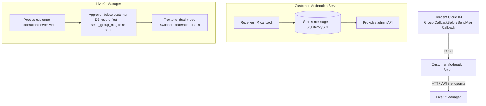
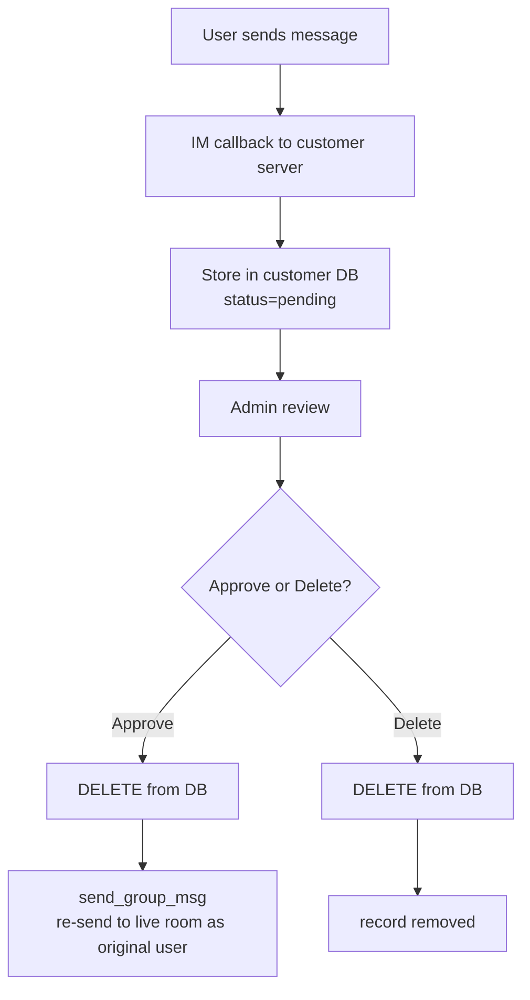

# Custom Text Moderation (User-Owned) Interception

> ⚠️ **Important**
>
> The design goal of the `custom` moderation mode is that **the customer develops their own moderation server**: the customer has full control over moderation logic, storage, and deployment.
>
> The `packages/custom-moderation-server/` in this repository is **only a minimal prototype (reference implementation) to help you get the whole flow working**. It uses SQLite storage and implements the bare minimum — "block everyone + moderation list". **It must NOT be used directly in production** — it lacks production-grade capabilities such as concurrency safety, horizontal scaling, hardened authentication, and data backup.
>
> The correct approach is: use this prototype's interface spec and interaction flow as a reference, then rewrite it into a server that fits your own business (database, moderation rules, deployment shape).

## Overview

LiveKit Manager supports two text moderation modes:

| Mode | Description | Config value |
|------|-------------|--------------|
| **Tencent Cloud IM Cloud Moderation** (default) | Uses Tencent Cloud IM's built-in cloud moderation engine to automatically intercept violating messages | `cloud` |
| **User-Owned Moderation** | A **customer-developed** moderation server that uses IM callback pre-interception + the customer's own database to implement fully custom moderation logic | `custom` |

## Architecture



## Quick Start

> The following steps are for **validating the whole flow locally**. Step 1 uses the minimal prototype, which is only to confirm the chain works — do NOT deploy it to production directly.

### 1. Validate quickly with the minimal prototype (flow validation only, not production)

```bash
cd packages/custom-moderation-server

# Install dependencies
npm install

# Copy the config file
cp config/example.env config/.env

# Start (port 9001)
npm start
```

> ⚠️ This is the repository's **minimal prototype**, intended to let you verify the full chain "IM callback → intercept → moderation list → approve" within minutes.
> For real deployment, implement and deploy your own moderation server based on the [Customer Moderation Server Interface Spec](#customer-moderation-server-interface-spec), then configure its address into `CUSTOM_MODERATION_BASE_URL`.

### 2. Configure the Main Server to use custom moderation

Edit `packages/server/config/.env`:

```bash
# Switch to custom moderation mode
MODERATION_MODE=custom

# Customer moderation server address (demo server defaults to http://localhost:9001)
CUSTOM_MODERATION_BASE_URL=http://localhost:9001

# API Key (optional; demo server has none configured by default, leave empty)
# CUSTOM_MODERATION_API_KEY=your_api_key
```

### 3. Configure the callback in the Tencent Cloud IM console

1. Log in to the [Tencent Cloud IM Console](https://console.cloud.tencent.com/im)
2. Open the target app → Callback configuration
3. Enable `Group.CallbackBeforeSendMsg` (before-group-message-send callback)
4. Set the callback URL to your moderation server's address, e.g. `http://your-domain:9001/im-callback`

### 4. Test

```bash
# Simulate an IM callback (message intercepted)
curl -X POST http://localhost:9001/im-callback \
  -H "Content-Type: application/json" \
  -d '{
    "CallbackCommand": "Group.CallbackBeforeSendMsg",
    "GroupId": "test_live_room",
    "From_Account": "user_001",
    "MsgBody": [{"MsgType": "TIMTextElem", "MsgContent": {"Text": "hello"}}]
  }'

# View the moderation list
curl -X POST http://localhost:9001/moderation/list \
  -H "Content-Type: application/json" \
  -d '{"Receiver": "test_live_room", "PageNo": 1, "PageSize": 10}'
```

---

## Customer Moderation Server Interface Spec

All endpoints are prefixed with `{CUSTOM_MODERATION_BASE_URL}`, configured via env.

### Authentication (optional)

If `CUSTOM_MODERATION_API_KEY` is configured, LiveKit Manager sends it in every request:

```
X-Api-Key: {CUSTOM_MODERATION_API_KEY}
```

### Endpoint 1: Global moderation toggle

#### Query toggle status

`GET /moderation/toggle`

Request parameters: none

Response:
```json
{
  "ActionStatus": "OK",
  "ErrorCode": 0,
  "Enabled": true
}
```

#### Set toggle status

`POST /moderation/toggle`

Request body:
```json
{
  "Enabled": true
}
```

Response:
```json
{
  "ActionStatus": "OK",
  "ErrorCode": 0,
  "Enabled": true
}
```

Field description:
- `Enabled`: `true` enables global moderation (all messages intercepted), `false` disables it (messages delivered normally)

### Endpoint 2: Moderation message list

`POST /moderation/list`

Request body (aligned with Tencent Cloud `DescribeCloudAuditRecordDetailV2` format):
```json
{
  "SdkAppId": 1400000000,
  "PageNo": 1,
  "PageSize": 20,
  "Scene": "Group",
  "Receiver": "live_room_id"
}
```

Field description:
| Field | Type | Required | Description |
|-------|------|----------|-------------|
| `SdkAppId` | number | yes | IM application ID |
| `PageNo` | number | yes | Page number (starts from 1) |
| `PageSize` | number | yes | Page size (max 100) |
| `Scene` | string | yes | Scene, fixed to `"Group"` |
| `Receiver` | string | yes | Live room ID (corresponds to GroupId) |

Response (aligned with Tencent Cloud `DescribeCloudAuditRecordDetailV2.Data` array format):
```json
{
  "TotalCount": 100,
  "RequestId": "req_1234567890",
  "Data": [
    {
      "ContentId": "msg_001",
      "From_Account": "user_alice",
      "Content": "intercepted message content",
      "Time": "2026-06-30 14:30:00.000"
    }
  ]
}
```

Field description:
| Field | Type | Required | Description |
|-------|------|----------|-------------|
| `TotalCount` | number | yes | Total record count (for pagination) |
| `RequestId` | string | no | Request ID |
| `Data[].ContentId` | string | yes | Unique message ID (used for later delete/approve) |
| `Data[].From_Account` | string | yes | Sender's IM account |
| `Data[].Content` | string | yes | Message text content |
| `Data[].Time` | string | yes | Message time (format `YYYY-MM-DD HH:mm:ss.SSS`) |

> **Note**: The `Label` (moderation tag) field is not needed in custom mode. The corresponding column on the frontend is hidden.

### Endpoint 3: Delete moderation records

`POST /moderation/delete`

Request body:
```json
{
  "SdkAppId": 1400000000,
  "ContentIds": ["msg_001", "msg_002"]
}
```

Response:
```json
{
  "ActionStatus": "OK",
  "ErrorCode": 0,
  "DeletedCount": 2,
  "RequestId": "req_1234567890"
}
```

Field description:
| Field | Type | Description |
|-------|------|-------------|
| `DeletedCount` | number | Actual number of records deleted |

### Error response format

On error, all endpoints return:
```json
{
  "ActionStatus": "FAIL",
  "ErrorCode": 500,
  "ErrorInfo": "error description"
}
```

---

## IM Callback Format

### Group.CallbackBeforeSendMsg callback

Tencent Cloud IM fires this callback before delivering a group message; the customer server must handle it.

#### Request (Tencent Cloud → customer server)

```json
{
  "CallbackCommand": "Group.CallbackBeforeSendMsg",
  "GroupId": "live_room_123",
  "Type": "Public",
  "From_Account": "user_456",
  "Operator_Account": "",
  "Random": 123456,
  "MsgBody": [
    {
      "MsgType": "TIMTextElem",
      "MsgContent": {
        "Text": "message sent by the user"
      }
    }
  ]
}
```

Key fields:
| Field | Description |
|-------|-------------|
| `GroupId` | Live room ID |
| `From_Account` | Sender's IM account |
| `MsgBody[].MsgContent.Text` | Text message content |

#### Response (customer server → Tencent Cloud)

**Intercept message** (not delivered to the live room):
```json
{
  "ActionStatus": "OK",
  "ErrorCode": 1,
  "ErrorInfo": "Message intercepted for moderation"
}
```

**Pass message** (delivered normally):
```json
{
  "ActionStatus": "OK",
  "ErrorCode": 0,
  "ErrorInfo": ""
}
```

> **Key**: `ErrorCode` of `0` means pass, non-zero means intercept. On callback timeout the message is passed by default (to guarantee deliverability).

#### Callback timeout fallback

Tencent Cloud IM's callback timeout is 2 seconds. If the customer server does not respond within 2 seconds, IM will **automatically pass** the message.

**Recommendations**:
- The callback handler should perform a fast storage operation (e.g. SQLite INSERT) at millisecond-level latency
- Do not perform time-consuming external API calls inside the callback handler

---

## Moderation Message Lifecycle



### Approve flow (handled by LiveKit Manager)

1. Admin clicks "Approve"
2. LiveKit Manager calls `send_group_msg` (with `NoMsgCheck` to skip re-moderation) to re-send the message as the original user
3. After re-sending succeeds, it calls the customer server's `POST /moderation/delete` to delete the corresponding record
4. **Each message is processed independently**: delete one on success; keep in DB on failure

### Delete flow

1. Admin clicks "Delete"
2. LiveKit Manager calls the customer server's `POST /moderation/delete` to delete the corresponding record

---

## Global Moderation Toggle

A "Global Moderation" switch at the top of the moderation list controls whether all messages are intercepted.

| Toggle state | Customer server behavior | LiveKit Manager behavior |
|--------------|--------------------------|--------------------------|
| **On** | IM callback returns `ErrorCode: 1` (intercept), message stored in DB | Moderation list shows intercepted messages for admin review |
| **Off** | IM callback returns `ErrorCode: 0` (pass), message delivered directly | Moderation list still shows historical intercepted records |

> After the toggle is off, previously intercepted messages **remain in the database** and the admin can still view and handle them.

---

## LiveKit Manager Configuration

| Config item | Required | Default | Description |
|-------------|----------|---------|-------------|
| `MODERATION_MODE` | no | `cloud` | Moderation mode: `cloud` (Tencent Cloud) \| `custom` (customer-owned) |
| `CUSTOM_MODERATION_BASE_URL` | required in custom mode | - | Customer moderation server Base URL |
| `CUSTOM_MODERATION_API_KEY` | no | - | API Key for calling the customer server (not sent if not configured) |

### Full .env example

```bash
# Moderation mode
MODERATION_MODE=custom
CUSTOM_MODERATION_BASE_URL=http://localhost:9001
# CUSTOM_MODERATION_API_KEY=sk-xxxxxxxx
```

---

## Demo Server Notes (minimal prototype, not for production)

> ⚠️ `packages/custom-moderation-server/` is a **minimal prototype (reference implementation)** to help you understand the interface contract and interaction flow. **Do not use it directly in production.**
> For production, develop your own server based on the interface spec below, and add authentication, concurrency, storage, backup, and monitoring capabilities.

The demo server (`packages/custom-moderation-server/`) uses single-file SQLite storage and implements the bare minimum "global intercept + moderation list + approve/delete":

| Component | File | Description |
|-----------|------|-------------|
| Entry | `src/index.js` | Express server startup |
| Database | `src/db.js` | SQLite operations (insert/list/delete/toggle) |
| IM callback | `src/routes/callback.js` | `Group.CallbackBeforeSendMsg` handler |
| Admin API | `src/routes/moderation.js` | Toggle + List + Delete endpoints |
| Auth | `src/middleware/auth.js` | Optional API Key check |
| Config | `config/example.env` | Config template |

### Minimum requirements when developing your own

To evolve from the prototype to production, at least consider:

- **Hardened authentication**: enable `CUSTOM_MODERATION_API_KEY` verification on all admin APIs, and isolate IM callback vs. admin interface access.
- **Storage choice**: replace SQLite with a horizontally scalable database (e.g. MySQL / PostgreSQL / cloud DB), with proper indexing and archival strategy.
- **Concurrency & availability**: the prototype is single-process in-memory + file DB; production should use multi-instance deployment, connection pooling, timeouts, and retries.
- **Data security**: regular backups, encryption of sensitive data, operation audit.
- **Callback performance**: IM callback auto-passes after a 2-second timeout, so the callback handler must do lightweight, fast storage without blocking.

### Database schema

```sql
-- Moderation message table
CREATE TABLE moderation_messages (
  content_id   TEXT PRIMARY KEY,
  group_id     TEXT NOT NULL,      -- live room ID
  from_account TEXT NOT NULL,      -- sender account
  content      TEXT NOT NULL,      -- message content
  msg_type     TEXT DEFAULT 'TIMTextElem',
  msg_body     TEXT,               -- raw MsgBody JSON
  created_at   TEXT NOT NULL DEFAULT (datetime('now','localtime')),
  status       TEXT DEFAULT 'pending'
);

-- Config table (toggle, etc.)
CREATE TABLE moderation_config (
  key   TEXT PRIMARY KEY,
  value TEXT NOT NULL
);
```

### Local dev / run

```bash
cd packages/custom-moderation-server

# Dev mode (auto-restart on file change)
npm run dev

# Production mode
npm start
```

---

## Dual-mode moderation comparison

| Feature | cloud mode | custom mode |
|---------|------------|-------------|
| Moderation data source | Tencent Cloud `DescribeCloudAuditRecordDetailV2` | Customer's own database |
| Moderation list columns | id / userID / content / **label type** / time | id / userID / content / time |
| Action buttons | Approve / Delete / **More** (correction whitelist) | Approve / Delete |
| Global moderation toggle | none | **yes** |
| Delete implementation | IndexedDB frontend mark | Customer server DELETE |
| Approve implementation | send_group_msg + IndexedDB mark | send_group_msg + customer server DELETE |
| Correction whitelist | supported | **not supported** |

---

## FAQ

### Q: What happens to the live room if the customer server goes down?

A: After the IM callback times out (2s), Tencent Cloud IM automatically passes the message. Messages are not lost. But new messages will not appear in the moderation list until the customer server recovers.

### Q: Why is there no "label type" column in the moderation list?

A: In custom mode, the moderation logic is controlled by the customer, so there are no predefined labels like "Porn/Abuse/Ad". The reviewer sees all intercepted messages and decides one by one whether to approve them.

### Q: After approving a message, why are "other messages from the same user" still in the list?

A: Each message is processed independently. Batch approve lets you process multiple messages together.

### Q: Can I switch back to Tencent Cloud moderation?

A: Yes. Change `MODERATION_MODE` back to `cloud` and restart the service. The switch does not lose data — the customer server's data is retained.

### Q: How do I implement custom moderation rules (e.g. sensitive-word filtering)?

A: Implement it in the customer server's IM callback handler. Example:
```javascript
// callback.js
const blockedWords = ['word1', 'word2'];
const content = extractTextContent(req.body.MsgBody);
if (blockedWords.some(w => content.includes(w))) {
  // intercept
  db.insertMessage({...});
  res.json({ ActionStatus: 'OK', ErrorCode: 1 });
} else {
  // pass
  res.json({ ActionStatus: 'OK', ErrorCode: 0 });
}
```
