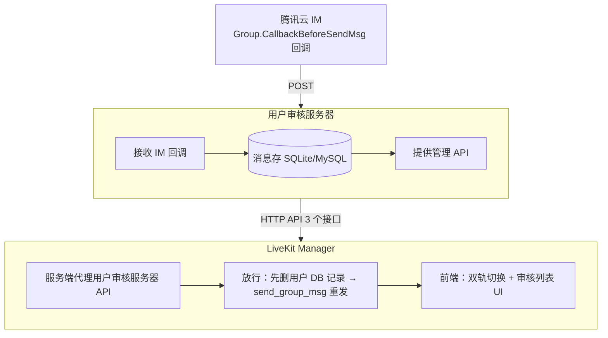
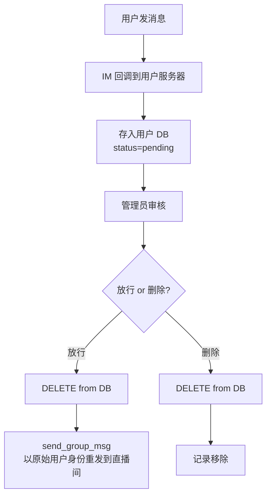

# 概述

LiveKit Manager 支持两种文本审核模式：

| 模式 | 说明 | 配置值 |
|------|------|--------|
| **腾讯云 IM 云端审核** | 使用腾讯云 IM 内置的云端审核引擎，自动拦截违规消息 | `cloud` |
| **用户自有审核** | 由**用户自行开发**的审核服务器，通过 IM 回调前置拦截 + 用户自有数据库，实现完全自定义的审核逻辑 | `custom` |

## 架构



## 快速开始

### 1. 用最小原型快速验证（仅验证链路，非生产）

```bash
cd packages/custom-moderation-server

# 安装依赖
npm install

# 复制配置文件
cp config/example.env config/.env

# 启动（端口 9001）
npm start
```

<Alert type="warning">

**警告：**

这是仓库自带的**最小原型**，目的是让你在几分钟内验证「IM 回调 → 拦截 → 审核列表 → 放行」全链路。
真正上线时，请基于 [用户审核服务器接口规范](#用户审核服务器接口规范) 自行实现并部署你的审核服务器，再将其地址配置到 `CUSTOM_MODERATION_BASE_URL`。

</Alert>

### 2. 配置 Main Server 使用自定义审核

编辑 `packages/server/config/.env`：

```bash
# 切换到自定义审核模式
MODERATION_MODE=custom

# 用户审核服务器地址（Demo 服务器默认 http://localhost:9001）
CUSTOM_MODERATION_BASE_URL=http://localhost:9001

# API Key（可选，Demo 服务器默认未配置，留空即可）
# CUSTOM_MODERATION_API_KEY=your_api_key
```

### 3. 在腾讯云 IM 控制台配置回调

1. 进入 <Ref type="link" href="https://console.cloud.tencent.com/im/callback-setting">IM 回调配置页面</Ref>
2. 在 **消息服务 Chat 回调URL配置** 右上角点击**编辑**，填入回调 URL（例如：`http://your-domain:9001/im-callback`），点击**确定**
3. 在 **消息服务 Chat 回调配置** 右上角点击**编辑**，找到**群内发言之前回调**，打开开关，然后点击**保存**

### 4. 测试

```bash
# 模拟 IM 回调（消息被拦截）
curl -X POST http://localhost:9001/im-callback \
  -H "Content-Type: application/json" \
  -d '{
    "CallbackCommand": "Group.CallbackBeforeSendMsg",
    "GroupId": "test_live_room",
    "From_Account": "user_001",
    "MsgBody": [{"MsgType": "TIMTextElem", "MsgContent": {"Text": "你好"}}]
  }'

# 查看审核列表
curl -X POST http://localhost:9001/moderation/list \
  -H "Content-Type: application/json" \
  -d '{"Receiver": "test_live_room", "PageNo": 1, "PageSize": 10}'
```

## 用户审核服务器接口规范

所有接口以 `{CUSTOM_MODERATION_BASE_URL}` 为前缀，通过 env 配置。

### 认证（可选）

若配置了 `CUSTOM_MODERATION_API_KEY`，LiveKit Manager 在所有请求中携带：

```
X-Api-Key: {CUSTOM_MODERATION_API_KEY}
```

### 接口 1：全员审核开关

#### 查询开关状态

`GET /moderation/toggle`

请求参数：无

响应：
```json
{
  "ActionStatus": "OK",
  "ErrorCode": 0,
  "Enabled": true
}
```

#### 设置开关状态

`POST /moderation/toggle`

请求体：
```json
{
  "Enabled": true
}
```

响应：
```json
{
  "ActionStatus": "OK",
  "ErrorCode": 0,
  "Enabled": true
}
```

字段说明：
- `Enabled`: `true` 表示开启全员审核（所有消息被拦截），`false` 表示关闭（消息正常投递）

### 接口 2：审核消息列表

`POST /moderation/list`

请求体：
```json
{
  "Receiver": "live_room_id",
  "PageNo": 1,
  "PageSize": 20
}
```

字段说明：
| 字段 | 类型 | 必填 | 说明 |
|------|------|------|------|
| `Receiver` | string | 是 | 直播间 ID（对应 GroupId） |
| `PageNo` | number | 是 | 页码（从 1 开始） |
| `PageSize` | number | 是 | 每页条数（最大 100） |

响应（对齐腾讯云 `DescribeCloudAuditRecordDetailV2.Data` 数组格式）：
```json
{
  "TotalCount": 100,
  "RequestId": "req_1234567890",
  "Data": [
    {
      "ContentId": "msg_001",
      "From_Account": "user_alice",
      "Content": "被拦截的消息内容",
      "Time": "2026-06-30 14:30:00.000"
    }
  ]
}
```

字段说明：
| 字段 | 类型 | 必填 | 说明 |
|------|------|------|------|
| `TotalCount` | number | 是 | 总记录数（用于分页计算） |
| `RequestId` | string | 否 | 请求 ID |
| `Data[].ContentId` | string | 是 | 消息唯一 ID（用于后续删除/放行） |
| `Data[].From_Account` | string | 是 | 发送者 IM 账号 |
| `Data[].Content` | string | 是 | 消息文本内容 |
| `Data[].Time` | string | 是 | 消息时间（格式 `YYYY-MM-DD HH:mm:ss.SSS`） |

<Alert type="notice">

**注意：**

自定义审核模式下不需要 `Label`（审核标签）字段。前端对应列会被隐藏。

</Alert>

### 接口 3：删除审核记录

`POST /moderation/delete`

请求体：
```json
{
  "ContentIds": ["msg_001", "msg_002"]
}
```

响应：
```json
{
  "ActionStatus": "OK",
  "ErrorCode": 0,
  "DeletedCount": 2,
  "RequestId": "req_1234567890"
}
```

字段说明：
| 字段 | 类型 | 说明 |
|------|------|------|
| `DeletedCount` | number | 实际删除的记录数 |

### 错误响应格式

所有接口错误时返回：
```json
{
  "ActionStatus": "FAIL",
  "ErrorCode": 500,
  "ErrorInfo": "错误描述"
}
```

## IM 回调格式

### Group.CallbackBeforeSendMsg 回调

腾讯云 IM 在群消息投递前的回调，用户服务器需要处理此回调。

#### 请求（腾讯云 → 用户服务器）

```json
{
  "CallbackCommand": "Group.CallbackBeforeSendMsg",
  "GroupId": "live_room_123",
  "Type": "Public",
  "From_Account": "user_456",
  "Operator_Account": "",
  "Random": 123456,
  "MsgBody": [
    {
      "MsgType": "TIMTextElem",
      "MsgContent": {
        "Text": "用户发送的消息内容"
      }
    }
  ]
}
```

关键字段：
| 字段 | 说明 |
|------|------|
| `GroupId` | 直播间 ID |
| `From_Account` | 发送者 IM 账号 |
| `MsgBody[].MsgContent.Text` | 文本消息内容 |

#### 响应（用户服务器 → 腾讯云）

**拦截消息**（不投递到直播间）：
```json
{
  "ActionStatus": "OK",
  "ErrorCode": 1,
  "ErrorInfo": "Message intercepted for moderation"
}
```

**放行消息**（正常投递）：
```json
{
  "ActionStatus": "OK",
  "ErrorCode": 0,
  "ErrorInfo": ""
}
```

<Alert type="notice">

**注意：**

`ErrorCode` 为 `0` 表示放行，非 `0` 表示拦截。回调超时默认放行（保障消息可达性）。

</Alert>

#### 回调超时兜底

腾讯云 IM 回调超时时间为 2 秒。如果用户服务器在 2 秒内未响应，IM 将**自动放行**消息。

**建议**：
- 用户服务器的回调处理器应执行快速存储操作（如 SQLite INSERT），耗时控制在毫秒级
- 不要在回调处理器中执行耗时的外部 API 调用

## 审核消息生命周期



### 放行流程（LiveKit Manager 负责）

1. 管理员点击「放行」
2. LiveKit Manager 调用 `send_group_msg`（带 `NoMsgCheck` 跳过再审）以原始用户身份重发消息
3. 重发成功后，调用用户服务器的 `POST /moderation/delete` 删除对应记录
4. **每条消息独立处理**：成功一条删一条，失败保留在数据库

### 删除流程

1. 管理员点击「删除」
2. LiveKit Manager 调用用户服务器的 `POST /moderation/delete` 删除对应记录

## 双轨审核模式对比

| 功能 | cloud 模式 | custom 模式 |
|------|-----------|------------|
| 审核数据来源 | 腾讯云 `DescribeCloudAuditRecordDetailV2` | 用户自有数据库 |
| 审核列表字段 | id / 用户ID / 内容 / **识别类型** / 时间 | id / 用户ID / 内容 / 时间 |
| 操作按钮 | 放行 / 删除 / **更多**（纠错白名单） | 放行 / 删除 |
| 全员审核开关 | 无 | **有** |
| 删除实现 | IndexedDB 前端标记 | 用户服务器 DELETE |
| 放行实现 | send_group_msg + IndexedDB 标记 | send_group_msg + 用户服务器 DELETE |
| 纠错白名单 | 支持 | **不支持** |
## 常见问题

### Q: 用户服务器挂了对直播间有什么影响？

A: IM 回调超时（2 秒）后，腾讯云 IM 会自动放行消息。消息不会丢失。但新消息不会进入审核列表，直到用户服务器恢复。

### Q: 审核列表为什么没有「识别类型」列？

A: 自定义审核模式下，审核逻辑由用户自己控制，没有「Porn/Abuse/Ad」等预定义标签。审核员看到的是所有被拦截的消息，逐一判断是否放行。

### Q: 放行消息后，为什么之前拦截的「同一用户的其他消息」还在列表里？

A: 每条消息独立处理。批量放行可以选择多条消息一起处理。

### Q: 是否可以切换回腾讯云审核？

A: 可以。将 `MODERATION_MODE` 改回 `cloud` 并重启服务即可。切换不丢失数据——用户服务器的数据仍然保留。

### Q: 如何实现自定义审核规则（如敏感词过滤）？

A: 在用户服务器的 IM 回调处理器中实现。示例：
```javascript
// callback.js
const blockedWords = ['敏感词1', '敏感词2'];
// 从 MsgBody 提取文本内容（假设只处理第一条文本消息）
const content = req.body.MsgBody[0]?.MsgContent?.Text || '';

if (content && blockedWords.some(w => content.includes(w))) {
  // 拦截，并将消息存入数据库
  db.insertMessage({
    content_id: `msg_${Date.now()}`,
    group_id: req.body.GroupId,
    from_account: req.body.From_Account,
    content: content,
    msg_body: JSON.stringify(req.body.MsgBody)
  });
  res.json({ ActionStatus: 'OK', ErrorCode: 1 });
} else {
  // 放行
  res.json({ ActionStatus: 'OK', ErrorCode: 0 });
}
```
